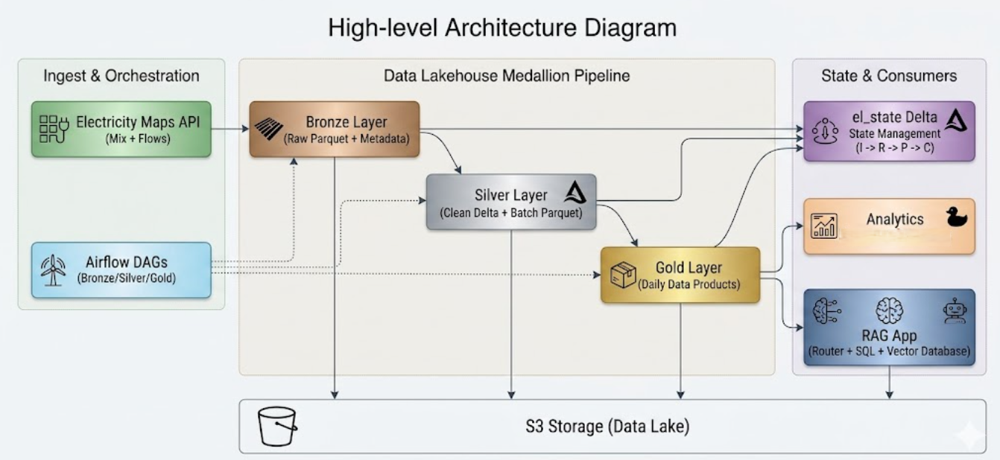
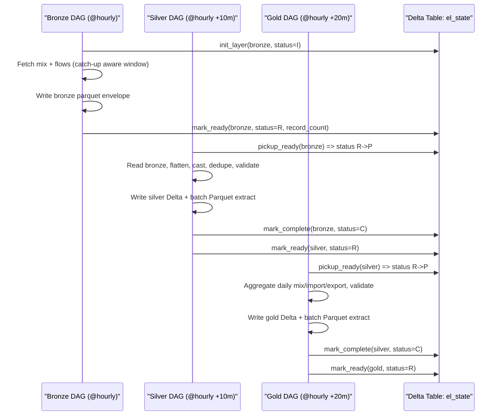

# Electricity Maps ETL Pipeline (France)

ETL pipeline for Electricity Maps v4 API data (zone `FR`) using a Medallion architecture:
`Bronze -> Silver -> Gold`.

The solution is designed for analytics on energy transition trends and includes an architecture extension for RAG-based Q&A over structured and unstructured data.

## Overview

- **Domain**: Electricity production mix and cross-border electricity flows for France.
- **Goal**: Deliver reliable, partitioned datasets for analysts/data scientists.
- **Data Products**:
  - Daily relative electricity mix percentages.
  - Daily net imports (MWh) by source zone.
  - Daily net exports (MWh) by destination zone.
- **Architecture style**: Medallion layers + state-driven orchestration (`el_state`).

## Design Decisions

| Area | Decision | Why? |
|---|---|---|
| Processing framework | Polars + Delta Lake (`deltalake-rs`) | Fast single-node processing with an open table format for reliable downstream analytics. |
| Bronze storage model | Raw immutable envelope with metadata | Preserves exact API payload plus lineage fields (`ingestion_timestamp`, `source_url`, `zone`, range). |
| Orchestration pattern | Decoupled Airflow DAGs + `el_state` state machine (`I -> R -> P -> C`) | Enables independent layer scheduling while preserving deterministic handoff and status tracking. |
| Storage strategy | S3-backed Delta tables + batch Parquet extracts | Meets table-management needs and explicit Parquet deliverable requirements for Silver/Gold. |
| Deployment scope | Single-node deployment with Docker + Docker Compose | Keeps operations simple for assignment scale while remaining reproducible and easy to run end-to-end. |
| Validation and DQ | Pydantic for API contracts + Pandera for DataFrames + bad-data tables | Enforces typed schemas and captures parse/schema failures without stopping valid data flow. |
| Reliability | HTTP retry/backoff, stateful error recording, CI gate | Handles rate limits/transient failures and improves operational confidence before deployment. |

## Architecture

### High-level Diagram




The pipeline ingests hourly France electricity data, standardizes it through Bronze/Silver/Gold, and publishes analytics-ready daily datasets on S3.  
Airflow orchestrates independent layer runs through `el_state`, while notebooks and the RAG layer consume Gold outputs for analysis and Q&A.

### High-level Components

- **Ingestion**: Electricity Maps API (`electricity-mix/past-range`, `electricity-flows/past-range`)
- **Storage**:
  - Bronze raw Parquet
  - Silver Delta + batch Parquet export
  - Gold Delta + batch Parquet export
  - `state/el_state` Delta table for process tracking
- **Orchestration**: 3 decoupled Airflow DAGs
- **Analytics**: DuckDB notebook queries on Delta/Parquet
- **RAG design**: see [`rag_architecture_design.md`](./rag_architecture_design.md)

### Layer Sequence Diagram



## Repository Structure

```text
.
├── dags/                         # Airflow DAGs (bronze/silver/gold)
├── notebooks/                    # Iterative development + query + RAG demo notebooks
├── src/electricity_maps/
│   ├── api/                      # HTTP client + API models
│   ├── layers/                   # bronze.py / silver.py / gold.py
│   ├── schemas/                  # pandera schemas
│   ├── utils/                    # helpers, partitioning, state
│   └── config.py                 # settings loader
├── tests/                        # unit tests
├── rag_architecture_design.md    # LLM/RAG high-level design
└── .github/workflows/ci.yml      # CI pipeline
```

## Installation

### Prerequisites

- Python `3.12+`
- `uv` package manager
- Docker + Docker Compose (for Airflow run mode)
- S3 bucket + AWS credentials
- Electricity Maps sandbox API key

### Setup

```bash
uv venv .venv
.venv\Scripts\activate
uv pip install -e ".[dev]"   #for local
```

### Configuration

Configure `config/env_prod.properties` with runtime values:

- `EMAPS_API_KEY`
- `EMAPS_API_BASE_URL`
- `EMAPS_ZONE=FR`
- `EMAPS_DATA_DIR=s3://electricity-maps/data`
- `AWS_ACCESS_KEY_ID`
- `AWS_SECRET_ACCESS_KEY`
- `AWS_REGION`

Use environment-specific properties for test/prod separation.

## How To Run

### Option A: Airflow DAGs (recommended end-to-end mode)

```bash
docker-compose up -d --build
```

Airflow UI: `http://localhost:8080`

DAGs:
- `electricity_maps_bronze` (`@hourly`)
- `electricity_maps_silver` (`10 * * * *`)
- `electricity_maps_gold` (`20 * * * *`)

### Option B: Python layer execution

```python
from electricity_maps.layers.bronze import ingest_bronze
from electricity_maps.layers.silver import transform_silver
from electricity_maps.layers.gold import transform_gold

ingest_bronze()
transform_silver()
transform_gold()
```

### Option C: Notebooks

- `01_api_exploration.ipynb`: validate endpoints and schema shape
- `02_bronze_ingestion.ipynb`: test bronze ingest
- `03_silver_transform.ipynb`: test silver transformation
- `04_gold_aggregation.ipynb`: test gold transformation
- `05_query_delta_sql.ipynb`: Query util: to inspect the data in S3
- `06_rag_chatbot.ipynb`: hybrid SQL + document RAG demo

## Data Layer Schemas (Required Submission Item)

### Bronze

- Raw immutable API payload in `raw_json`
- Metadata:
  - `process_ts`
  - `ingestion_timestamp`
  - `source_url`
  - `zone`
  - `range_start`, `range_end`
  - `record_count`
- Partitioning: ingestion date (`year/month/day`)

### Silver

Tables:
- `electricity_mix` (flattened source-wise generation + storage + aggregate flow fields)
- `electricity_flows` (unpivoted `neighbor_zone`, `direction`, `power_mw`)
- `silver_mix_bad_data`, `silver_flows_bad_data` (failed parse/schema rows)

Partitioning: data timestamp (`year/month/day`)

Storage outputs:
- Delta: `s3://electricity-maps/data/silver/...`
- Batch parquet extract: `s3://electricity-maps/data/parquet/silver/{year}/{month}/{day}/{process_ts}/...`

### Gold

Tables:
- `daily_electricity_mix`
- `daily_imports`
- `daily_exports`

Partitioning: `year/month/day`

Storage outputs:
- Delta: `s3://electricity-maps/data/gold/...`
- Batch parquet extract: `s3://electricity-maps/data/parquet/gold/{year}/{month}/{day}/{process_ts}/...`

## S3 Layout Details

```text
s3://electricity-maps/data/
├── bronze/
├── silver/
├── gold/
├── state/el_state/
└── parquet/
    ├── silver/{year}/{month}/{day}/{process_ts}/...
    └── gold/{year}/{month}/{day}/{process_ts}/...
```

## Sample Output Snapshots (from notebooks)

Sample result prints are captured in notebook outputs:

- `notebooks/03_silver_transform.ipynb`
  - `Silver transformation result: {'process_ts': ..., 'mix_records': ..., 'flows_records': ...}`
- `notebooks/04_gold_aggregation.ipynb`
  - `Gold transformation result: {'process_ts': ..., 'mix_records': ..., 'imports_records': ..., 'exports_records': ...}`
- `notebooks/05_query_delta_sql.ipynb`
  - query snapshots for Bronze/Silver/Gold summary views


## Unit Tests and Data Quality Checks

- Test framework: `pytest`
- Coverage scope:
  - API client behavior
  - Bronze/Silver/Gold layer transformations
  - Pipeline state transitions
- Run tests:

```bash
pytest
```

Data quality controls:
- Schema enforcement with Pandera on Silver and Gold.
- Parse/schema failures captured in bad-data Delta tables.
- Deduplication on business keys in Silver.

## Error Handling, Rate-Limit, and Retry

- API client retries on:
  - HTTP `429` (rate limit)
  - HTTP `5xx`
  - network/timeout failures
- Retry policy: exponential backoff (Tenacity).
- Layer failure behavior:
  - exception is raised
  - `el_state` row is updated with error context
  - Airflow retries handle transient failures

## Incremental / Catch-up Design

- Bronze windowing:
  - `start = last bronze end_timestamp (floored to hour)` or fallback `now - 24h`
  - `end = current hour (floored)`
- Silver and Gold process only `el_state` rows in `R` state claimed to `P`.
- Ensures missed windows are automatically backfilled after downtime.

## CI/CD and Deployment

### CI

GitHub Actions workflow: `.github/workflows/ci.yml`

Expected CI checks:
- dependency install
- static quality checks (lint/type if configured)
- unit tests (`pytest`)

### Deployment

- Current deployment target: **single-node** environment.
- Runtime deployment mode: **Docker + Docker Compose** (Airflow webserver/scheduler + supporting services on one host).
- Local orchestrated deployment via Docker Compose + Airflow.
- Storage deployment target: AWS S3 paths configured in environment properties.

## Further TODO Tasks

- Move secrets to a secret manager (instead of config files).
- Add alerting/observability for DAG and data quality failures.
- Promote infrastructure via IaC pipeline (Terraform/CloudFormation) if required.
- Build observability and monitoring tooling.

## RAG Architecture Document

See full design submission for requirement section D:
- [`rag_architecture_design.md`](./rag_architecture_design.md)

## Notes

- This repo includes notebook-first validation plus modular Python layer code.
- Bronze/Silver/Gold can be run independently for debug, and coordinated via Airflow in production mode.
