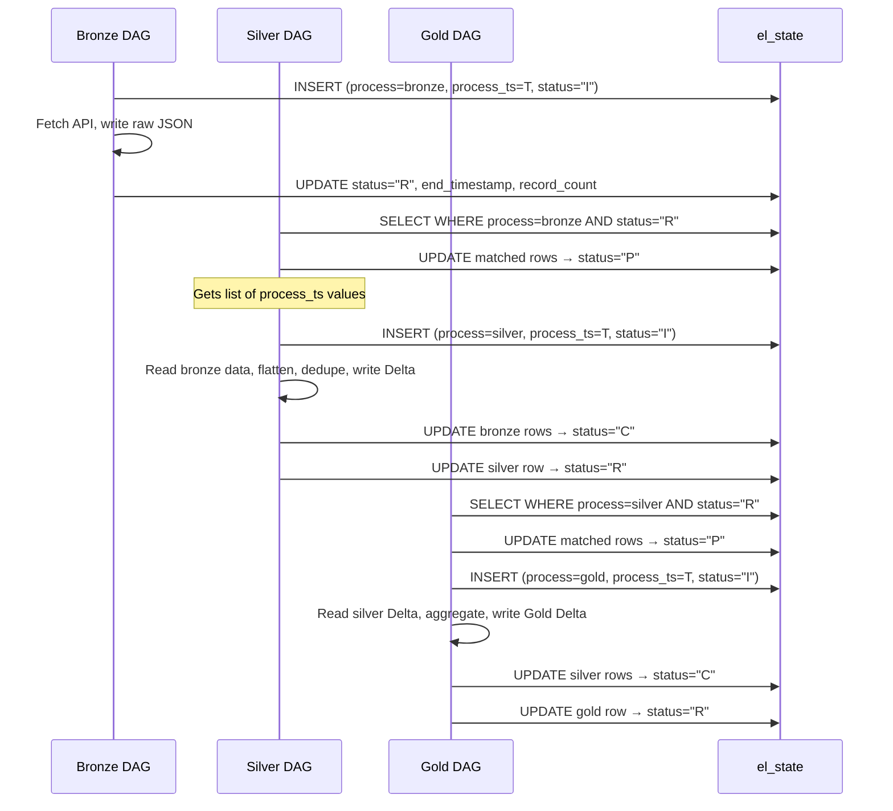
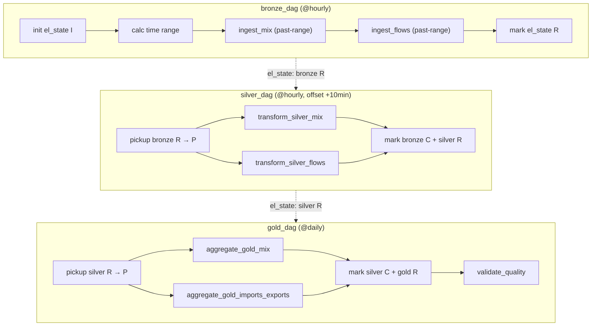

# 🔌 Electricity Maps ETL Pipeline — Implementation Plan (v2)

## 1. Technology Stack

| Decision | Choice | Rationale |
|---|---|---|
| Framework | **Polars + Delta-RS** | Fastest single-node, no JVM, native Delta support |
| HTTP Client | **httpx + tenacity** | Retries, rate-limit handling |
| API Validation | **Pydantic v2** | Type-safe API response models |
| DF Validation | **Pandera (polars)** | DataFrame-level schema contracts |
| Config | **pydantic-settings** | Typed `.env` config |
| Orchestration | **Apache Airflow** | Industry-standard ETL scheduler |
| Containerization | **Docker + docker-compose** | Reproducible, pairs with Airflow |
| Testing | **Jupyter Notebooks** | Interactive pipeline testing |
| CI/CD | **GitHub Actions** | Lint + test |
| State Tracking | **`el_state` Delta table** | Pipeline event/status tracking |

> [!NOTE]
> **No CLI** — pipeline runs via Airflow DAGs. Notebooks used for development/testing.

---

## 2. Actual V4 API Schemas (Verified from Sandbox)

### Electricity Mix: `GET /v4/electricity-mix/past-range?zone=FR&start=...&end=...`
Returns hourly records for the given time range. Key: `data` array.
```json
{
  "zone": "FR",
  "temporalGranularity": "hourly",
  "unit": "MW",
  "data": [
    {
      "datetime": "2026-04-23T09:00:00.000Z",
      "updatedAt": "2026-04-24T10:26:32.718Z",
      "isEstimated": true,
      "estimationMethod": "SANDBOX_MODE_DATA",
      "mix": {
        "nuclear": 27069.648,
        "geothermal": null,
        "biomass": 925.166,
        "coal": 0,
        "wind": 2686.155,
        "solar": 9533.531,
        "hydro": 3440.41,
        "gas": 328.065,
        "oil": 40.678,
        "unknown": null,
        "hydro storage": { "charge": 1239.355, "discharge": null },
        "battery storage": { "charge": 24.72, "discharge": null },
        "flows": { "exports": 8573, "imports": 348 }
      }
    }
  ]
}
```

### Electricity Flows: `GET /v4/electricity-flows/past-range?zone=FR&start=...&end=...`
```json
{
  "zone": "FR",
  "temporalGranularity": "hourly",
  "unit": "MW",
  "data": [
    {
      "datetime": "2026-04-23T09:00:00.000Z",
      "updatedAt": "2026-04-24T10:26:32.718Z",
      "import": { "BE": 561, "CH": 197, "DE": 102, "ES": 1147 },
      "export": { "DE": 335, "GB": 3016, "LU": 39, "IT-NO": 1926 }
    }
  ]
}
```

### Catch-Up Ingestion Logic
```
start = last el_state end_timestamp for bronze (rounded down to hour)
        OR default to 24h ago if no prior run
end   = current hour start (floor to hour)
```
This ensures **no data gaps** if the pipeline is down for hours — it catches up automatically.

> [!IMPORTANT]
> - `past-range` uses `data` array (not `history`)
> - `hydro storage` and `battery storage` are **nested objects** with charge/discharge
> - `flows` inside mix = aggregate totals; separate flows endpoint has per-zone breakdown
> - Some values are `null` (geothermal, unknown) — must handle nullable fields
> - Records that **fail to parse** → written to bad data tables (raw JSON preserved)

---

## 3. `el_state` Table Design (Pipeline State Tracking)

State machine per row: **`I` → `R` → `P` → `C`**

| Status | Meaning | Who sets it |
|---|---|---|
| `I` | **Init** — layer has started processing | Current layer on start |
| `R` | **Ready** — layer completed, data ready for downstream | Current layer on success |
| `P` | **Processing** — downstream layer picked it up | Downstream layer on pickup |
| `C` | **Complete** — downstream layer finished processing it | Downstream layer on success |

### Schema

| Column | Type | Description |
|---|---|---|
| `process` | `Utf8` | Layer name: `bronze`, `silver`, `gold` |
| `process_ts` | `Int64` | Epoch timestamp(with ms) — unique batch identifier, links layers |
| `start_timestamp` | `Datetime(us, UTC)` | When this layer started processing |
| `end_timestamp` | `Datetime(us, UTC)` (nullable) | When this layer finished (null while status=I) |
| `status` | `Utf8` | `I` / `R` / `P` / `C` |
| `record_count` | `Int64` (nullable) | Number of records processed (null while status=I) |
| `error_message` | `Utf8` (nullable) | Error details if any |

### Example Data Flow

```
| process | process_ts  | start_timestamp      | end_timestamp        | status | Notes                          |
|---------|-------------|----------------------|----------------------|--------|--------------------------------|
| bronze  | 1745489400  | 2026-04-24 14:00:00  | 2026-04-24 14:05:00  | C      | silver picked up & finished    |
| bronze  | 1745493000  | 2026-04-24 15:00:00  | 2026-04-24 15:05:00  | P      | silver is processing this now  |
| bronze  | 1745496600  | 2026-04-24 16:00:00  | 2026-04-24 16:05:00  | R      | ready for silver to pick up    |
| bronze  | 1745500200  | 2026-04-24 17:00:00  | null                 | I      | bronze still running           |
| silver  | 1745489400  | 2026-04-24 14:10:00  | 2026-04-24 14:15:00  | R      | ready for gold to pick up      |
| gold    | 1745489400  | 2026-04-24 14:20:00  | 2026-04-24 14:25:00  | R      | ready for embedding            |
```

### Flow Logic



### Key Design Points

1. **`I` on start** — Bronze writes entry immediately when it begins (tracks in-flight work)
2. **`R` on success** — Signals "my data is ready for the next layer"
3. **`P` on pickup** — Downstream layer claims the row (prevents double-processing)
4. **`C` on downstream complete** — Fully done, downstream consumed it
5. **`process_ts` (epoch)** is the linking key across all layers
6. **Batch pickup** — Silver picks up ALL bronze rows with `status="R"`
7. **Crash safety** — If bronze crashes, row stays at `I` (never becomes `R`). If silver crashes, row stays at `P` (can be retried)

### Implementation: `utils/state.py`
```python
class PipelineState:
    """Manages el_state Delta table (state machine: I → R → P → C)."""
    
    def init_layer(self, process: str, process_ts: int, start_ts: datetime):
        """INSERT row with status='I' when layer starts."""
    
    def mark_ready(self, process: str, process_ts: int,
                   end_ts: datetime, record_count: int):
        """UPDATE status='R' when layer completes successfully."""
    
    def pickup_ready(self, process: str) -> list[int]:
        """SELECT process_ts WHERE status='R', then UPDATE to 'P'. Returns list of process_ts."""
    
    def mark_complete(self, process: str, process_ts_list: list[int]):
        """UPDATE status='C' for rows consumed by downstream."""
    
    def get_state_summary(self) -> pl.DataFrame:
        """Return full el_state table for monitoring/debugging."""
```

---

## 4. Project Structure

```
ElectricityMaps/
├── README.md
├── pyproject.toml
├── Dockerfile
├── docker-compose.yml
├── .gitignore                         # Keys, data/, .env, __pycache__, .venv
├── .github/workflows/ci.yml
├── config/
│   ├── prod.env                       # Production config (active)
│   ├── test.env                       # Test config (mock API base URL, test data dir)
│   ├── dev.env                        # Dev config (future)
│   └── .env.example                   # Template with placeholder keys
├── dags/
│   ├── bronze_dag.py                  # DAG 1: Ingestion
│   ├── silver_dag.py                  # DAG 2: Transformation
│   └── gold_dag.py                    # DAG 3: Aggregation
├── notebooks/
│   ├── 01_api_exploration.ipynb       # Test API, explore schemas
│   ├── 02_bronze_ingestion.ipynb      # Test bronze layer
│   ├── 03_silver_transform.ipynb      # Test silver transforms
│   ├── 04_gold_aggregation.ipynb      # Test gold products
│   ├── 05_pipeline_e2e.ipynb          # Full pipeline test
│   └── 06_query_delta_sql.ipynb       # DuckDB SQL queries on Delta tables
├── src/
│   └── electricity_maps/
│       ├── __init__.py
│       ├── config.py                  # Loads env-specific config
│       ├── api/
│       │   ├── __init__.py
│       │   ├── client.py
│       │   └── models.py
│       ├── layers/
│       │   ├── __init__.py
│       │   ├── bronze.py
│       │   ├── silver.py
│       │   └── gold.py
│       ├── schemas/
│       │   ├── __init__.py
│       │   ├── silver_schemas.py
│       │   └── gold_schemas.py
│       └── utils/
│           ├── __init__.py
│           ├── state.py               # el_state table manager
│           ├── logging.py
│           └── partitioning.py
├── tests/
│   ├── conftest.py
│   ├── test_api_client.py
│   ├── test_bronze.py
│   ├── test_silver.py
│   ├── test_gold.py
│   ├── test_state.py
│   └── fixtures/                      # Generated from real API data
│       ├── mix_history_response.json   # Saved from notebook 01
│       └── flows_history_response.json
├── docs/
│   └── architecture.md
├── data/                              # .gitignore'd
│   ├── bronze/
│   ├── silver/
│   ├── gold/
│   └── state/
└── sample_outputs/
```

### Environment Config Strategy

```
config/
├── prod.env        ← Active. Contains real API key, prod data dir
├── test.env        ← For pytest. Points to test fixtures, mock API
├── dev.env         ← Future. Local dev overrides
└── .env.example    ← Template committed to git (no secrets)
```

**`config/prod.env`** (gitignored):
```env
EMAPS_ENV=prod
EMAPS_API_KEY=<real-key>
EMAPS_API_BASE_URL=https://api.electricitymaps.com/v4
EMAPS_DATA_DIR=./data
EMAPS_ZONE=FR
LLM_API_KEY=<llm-key>
```

**`config/test.env`**:
```env
EMAPS_ENV=test
EMAPS_API_KEY=test-key
EMAPS_API_BASE_URL=http://localhost:8888/mock
EMAPS_DATA_DIR=./tests/test_data
EMAPS_ZONE=FR
```

**Config loader** (`config.py`):
```python
class Settings(BaseSettings):
    env: str = "prod"
    api_key: str
    api_base_url: str = "https://api.electricitymaps.com/v4"
    data_dir: Path = Path("s3://electricity-maps/data")
    zone: str = "FR"

    model_config = SettingsConfigDict(
        env_file=f"config/{env}.env",
        env_prefix="EMAPS_",
    )
```

### .gitignore (keys + secrets)
```gitignore
# Secrets & keys
config/prod.env
config/dev.env
*.key
*.pem

# Data (runtime generated)
data/

# Python
__pycache__/
*.pyc
.venv/
*.egg-info/

# IDE
.idea/
.vscode/

# Notebooks checkpoints
.ipynb_checkpoints/
```

### Test Fixture Strategy

> [!IMPORTANT]
> **Pull real data first → save as fixtures → build tests from them.**

1. Notebook `01_api_exploration.ipynb` calls the API and saves raw JSON responses
2. Copy those JSONs into `tests/fixtures/`
3. Unit tests load fixtures (no API calls needed)
4. Integration tests run the full layer pipeline against fixtures
```

---

## 5. Phase Breakdown

### Phase 0: Scaffolding
| # | Task | File(s) |
|---|---|---|
| 0.1 | `pyproject.toml` with all deps | `pyproject.toml` |
| 0.2 | `.env.example` with `EMAPS_API_KEY`, `DATA_DIR` | `.env.example` |
| 0.3 | `.gitignore` (data/, .env, __pycache__, .venv) | `.gitignore` |
| 0.4 | Config module (Pydantic Settings) | `config.py` |
| 0.5 | Utils | `utils/utils.py` (reusuable functions to write/read/partition) |


### Phase 1: API Client
| # | Task | Details |
|---|---|---|
| 1.1 | Pydantic v2 models | Models for mix & flows `past-range` responses (nested storage, nullables) |
| 1.2 | `ElectricityMapsClient` class | httpx-based, `User-Agent` header (required for Cloudflare) |
| 1.3 | Retry logic | tenacity: exponential backoff, retry on 429/5xx |
| 1.4 | `get_mix_range(zone, start, end)` | `/v4/electricity-mix/past-range` → raw JSON dict |
| 1.5 | `get_flows_range(zone, start, end)` | `/v4/electricity-flows/past-range` → raw JSON dict |

### Phase 2: Bronze Layer
| # | Task | Details |
|---|---|---|
| 2.1 | `ingest_bronze(zone, process_ts)` | Main entry point |
| 2.2 | Write `el_state` entry (status=I) with process_ts | Via utils.py |
| 2.3 | Calculate time range | `start` = last bronze `process_ts` from `el_state` (floor to hour), `end` = current hour start |
| 2.4 | Call both API endpoints | `get_mix_range(zone, start, end)` + `get_flows_range(zone, start, end)` |
| 2.5 | Add metadata envelope | `_ingestion_timestamp`, `_source_url`, `_zone`, `_start`, `_end` |
| 2.6 | Store as parquet files | `bronze/{stream}/year=YYYY/month=MM/day=DD/{zone}_{process_ts}.parquet` |
| 2.7 | Update `el_state` to R | With record_count |
| 2.8 | Error handling | On failure → row stays at `I` (Airflow retries) |

**Catch-up example:** Pipeline down from 14:00–17:00, restarts at 17:05:
```
start = 14:00 (last el_state end_timestamp, floored)
end   = 17:00 (current hour start)
→ API returns 3 hours of data in one call
```

**Bronze output:**
```
data/bronze/electricity_mix/year=2026/month=04/day=24/FR_1745489400.parquet
data/bronze/electricity_flows/year=2026/month=04/day=24/FR_1745489400.parquet
```

### Phase 3: Silver Layer

#### Silver Table: `electricity_mix`
| Column | Type | Source |
|---|---|---|
| `zone` | `Utf8` | Top-level `zone` |
| `datetime` | `Datetime(us, UTC)` | `history[].datetime` |
| `updated_at` | `Datetime(us, UTC)` | `history[].updatedAt` |
| `is_estimated` | `Boolean` | `history[].isEstimated` |
| `estimation_method` | `Utf8` (nullable) | `history[].estimationMethod` |
| `nuclear_mw` | `Float64` | `mix.nuclear` |
| `geothermal_mw` | `Float64` (nullable) | `mix.geothermal` |
| `biomass_mw` | `Float64` | `mix.biomass` |
| `coal_mw` | `Float64` | `mix.coal` |
| `wind_mw` | `Float64` | `mix.wind` |
| `solar_mw` | `Float64` | `mix.solar` |
| `hydro_mw` | `Float64` | `mix.hydro` |
| `gas_mw` | `Float64` | `mix.gas` |
| `oil_mw` | `Float64` | `mix.oil` |
| `unknown_mw` | `Float64` (nullable) | `mix.unknown` |
| `hydro_storage_charge_mw` | `Float64` (nullable) | `mix["hydro storage"].charge` |
| `hydro_storage_discharge_mw` | `Float64` (nullable) | `mix["hydro storage"].discharge` |
| `battery_storage_charge_mw` | `Float64` (nullable) | `mix["battery storage"].charge` |
| `battery_storage_discharge_mw` | `Float64` (nullable) | `mix["battery storage"].discharge` |
| `flow_exports_mw` | `Float64` | `mix.flows.exports` |
| `flow_imports_mw` | `Float64` | `mix.flows.imports` |
| `year` | `Int32` | Partition key (from datetime) |
| `month` | `Int32` | Partition key |
| `day` | `Int32` | Partition key |

#### Silver Table: `electricity_flows`
| Column | Type | Source |
|---|---|---|
| `zone` | `Utf8` | Top-level `zone` (FR) |
| `datetime` | `Datetime(us, UTC)` | `history[].datetime` |
| `updated_at` | `Datetime(us, UTC)` | `history[].updatedAt` |
| `neighbor_zone` | `Utf8` | Key from import/export dict |
| `direction` | `Utf8` | `import` or `export` |
| `power_mw` | `Float64` | Value (MW) |
| `year` | `Int32` | Partition key |
| `month` | `Int32` | Partition key |
| `day` | `Int32` | Partition key |

**Dedup keys:** `(zone, datetime)` for mix; `(zone, datetime, neighbor_zone, direction)` for flows.

#### Bad Data Tables
Records that **fail to parse** (malformed JSON, unexpected schema) are written to bad data tables preserving the raw JSON.

| Table | Columns |
|---|---|
| `silver_mix_bad_data` | `process_ts`, `datetime`, `raw_json` (Utf8), `error_message`, `created_at` |
| `silver_flows_bad_data` | `process_ts`, `datetime`, `raw_json` (Utf8), `error_message`, `created_at` |

#### Silver Tasks
| # | Task |
|---|---|
| 3.1 | Pickup bronze rows with `status=R` → flip to `P` |
| 3.2 | Read Bronze JSON files for those `process_ts` values |
| 3.3 | Flatten mix: extract nested `mix.*`, `hydro storage.*`, `battery storage.*`, `flows.*` |
| 3.4 | Flatten flows: unpivot import/export dicts into rows with `neighbor_zone` + `direction` |
| 3.5 | **Bad data handling**: records failing to parse → write to bad data tables with raw JSON |
| 3.6 | Cast types (datetime, Float64, Boolean) |
| 3.7 | Deduplicate on unique keys |
| 3.8 | Pandera schema validation |
| 3.9 | Write Delta Lake tables, partitioned by `year/month/day`  and parse failed to error tables|
| 3.10 | Update bronze `el_state` → `C`, silver `el_state` → `R` |

### Phase 4: Gold Layer

#### Gold Table 1: `daily_electricity_mix`
| Column | Type |
|---|---|
| `zone` | `Utf8` |
| `zone_name` | `Utf8` ("France") |
| `date` | `Date` |
| `nuclear_pct` | `Float64` |
| `biomass_pct` | `Float64` |
| `wind_pct` | `Float64` |
| `solar_pct` | `Float64` |
| `hydro_pct` | `Float64` |
| `gas_pct` | `Float64` |
| `oil_pct` | `Float64` |
| `coal_pct` | `Float64` |
| `geothermal_pct` | `Float64` |
| `unknown_pct` | `Float64` |
| `total_production_mwh` | `Float64` |
| `fossil_free_avg_pct` | `Float64` |
| `renewable_avg_pct` | `Float64` |
| `hours_covered` | `Int32` |
| `year` | `Int32` |
| `month` | `Int32` |

#### Gold Table 2: `daily_imports`
| Column | Type |
|---|---|
| `zone` | `Utf8` |
| `zone_name` | `Utf8` |
| `source_zone` | `Utf8` |
| `date` | `Date` |
| `import_mwh` | `Float64` |
| `hours_covered` | `Int32` |
| `year` / `month` | `Int32` |

#### Gold Table 3: `daily_exports`
Same as imports but with `destination_zone` and `export_mwh`.

#### Gold Tasks
| # | Task |
|---|---|
| 4.1 | Query `el_state` for silver_mix/silver_flows with status=C |
| 4.2 | Read Silver Delta tables |
| 4.3 | Daily aggregation: group by (zone, date), sum MW → MWh |
| 4.4 | Calculate percentages (each source / total × 100) |
| 4.5 | Split flows into imports and exports tables |
| 4.6 | Add zone metadata |
| 4.7 | Pandera validation |
| 4.8 | Write Delta + Parquet |
| 4.9 | Update `el_state` to C |

### Phase 5: Airflow — 3 Independent DAGs

DAGs are **decoupled** — coordinated only via `el_state` Delta table.



#### DAG 1: `bronze_dag` (`dags/bronze_dag.py`)
| # | Task | Details |
|---|---|---|
| 5.1 | Schedule: `@hourly` | Runs every hour to ingest latest data |
| 5.2 | Task: `ingest_mix` | PythonOperator → `bronze.ingest_mix(zone, process_ts)` |
| 5.3 | Task: `ingest_flows` | PythonOperator → `bronze.ingest_flows(zone, process_ts)` |
| 5.4 | Task: `write_el_state` | On success → `state.write_completion("bronze", process_ts, ...)` |
| 5.5 | `process_ts` | Epoch from `{{ execution_date }}` |
| 5.6 | Retries: 2, delay: 5min | Handles transient API failures |

#### DAG 2: `silver_dag` (`dags/silver_dag.py`)
| # | Task | Details |
|---|---|---|
| 5.7 | Schedule: `@hourly` (offset +10min) | Runs after bronze has time to complete |
| 5.8 | Task: `pick_pending_bronze` | `state.get_pending("bronze")` → returns list of `process_ts` with `status=""` |
| 5.9 | Task: `transform_silver_mix` | For each `process_ts`: read bronze mix JSONs, flatten, write Delta |
| 5.10 | Task: `transform_silver_flows` | For each `process_ts`: read bronze flow JSONs, flatten, write Delta |
| 5.11 | Task: `mark_consumed_write_state` | `state.mark_consumed("bronze", ts_list)` + `state.write_completion("silver", ...)` |
| 5.12 | Short-circuit | If no pending bronze rows → DAG completes immediately (no-op) |

#### DAG 3: `gold_dag` (`dags/gold_dag.py`)
| # | Task | Details |
|---|---|---|
| 5.13 | Schedule: `@daily` | Daily aggregation |
| 5.14 | Task: `pick_pending_silver` | `state.get_pending("silver")` → returns pending `process_ts` list |
| 5.15 | Task: `aggregate_gold_mix` | Daily % mix from silver Delta |
| 5.16 | Task: `aggregate_gold_imports_exports` | Daily net MWh from silver flows Delta |
| 5.17 | Task: `mark_consumed_write_state` | `state.mark_consumed("silver", ts_list)` + `state.write_completion("gold", ...)` |
| 5.18 | Task: `validate_quality` | Pandera checks on Gold tables |

#### Outbox Pickup Pattern
```python
def pick_pending_and_process(upstream_layer: str, **kwargs):
    """Airflow task: pick up pending el_state rows and process them."""
    state = PipelineState(data_dir)
    pending_ts = state.get_pending(upstream_layer)  # list of epoch ints
    if not pending_ts:
        raise AirflowSkipException("No pending data to process")
    # Pass to downstream tasks via XCom
    kwargs["ti"].xcom_push(key="pending_ts", value=pending_ts)
```

### Phase 6: Docker + Notebooks + Bonus
| # | Task |
|---|---|
| 6.1 | `Dockerfile` (Python 3.12-slim) |
| 6.2 | `docker-compose.yml` (Airflow webserver + scheduler + postgres) |
| 6.3 | 5 Jupyter notebooks for interactive testing |
| 6.4 | Unit tests (pytest) |
| 6.5 | Incremental ingestion (watermark via el_state) |
| 6.6 | GitHub Actions CI |
| 6.7 | Sample outputs in `sample_outputs/` |

### Phase 7: RAG Chatbot — Design + Working Notebook
| # | Task | Details |
|---|---|---|
| 7.1 | `docs/architecture.md` | High-level design: application + infrastructure layers |
| 7.2 | Application layer diagram | FastAPI backend, Streamlit UI, LLM orchestrator |
| 7.3 | Infrastructure layer diagram | S3, vector store, LLM service |
| 7.4 | RAG pipeline design | Gold data embedding + doc chunking → vector search → LLM |
| 7.5 | `notebooks/07_rag_chatbot.ipynb` | Working demo: embed Gold data → ChromaDB → query with LLM |
| 7.6 | Example queries | "What % of France's electricity was nuclear yesterday?" |

### Phase 8: README & Polish
| # | Task |
|---|---|
| 8.1 | README with setup, run, schema docs |
| 8.2 | Docstrings + type hints |

---

## 6. Execution Order

```
Phase 0 → Phase 1 → Phase 2 → Phase 3 → Phase 4 → Phase 5 → Phase 6 → Phase 7 → Phase 8
```
