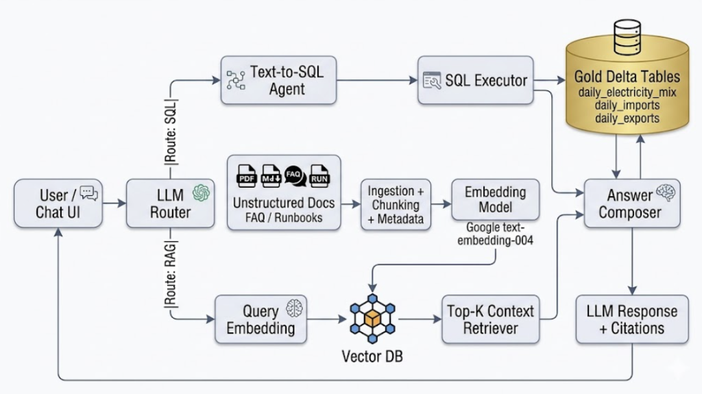

# Production RAG Architecture Design

## 1) Overview

Design details of the chat-bot assistant for Electricity Maps use cases:

- **Structured analytics questions** are answered from Gold tables (`daily_electricity_mix`, `daily_imports`, `daily_exports`) via **Text-to-SQL**.
- **Domain knowledge questions/Faq** are answered via **RAG over a vector database** which has embedded data of API docs, runbooks, FAQ, definitions.
- A single **LLM router** decides the best path as the per query and routes effectively.


---

## 2) Architecture

### High-Level Diagram



### Core Components

- **Router (`SQL` vs `RAG`)**: Classifies user intent into `SQL`, `RAG`, or `CLARIFY`.
- **Text-to-SQL path**: LLM generates constrained SQL from known schema; DuckDB executes against Gold Delta.
- **RAG path**: Embedding-based retrieval returns top chunks; LLM answers strictly from retrieved context.
- **Response composer**: Normalizes output format, confidence notes, citations, and fallback behaviors.

### Vector DB

**For now: `Chroma DB` (persistent mode).**

Why it is the right fit for this project now:

- Corpus size is bounded (docs + operational FAQs, not web-scale).
- Low-to-moderate concurrency is expected.
- Fast local development and simple deployment are priorities.
- Tight notebook/Python integration for current implementation style.

When to change:

- Move to **Qdrant** if you need stronger filtering/index performance and higher sustained query load.
- Move to **Pinecone/Weaviate Cloud** for managed, elastic, high-concurrency workloads.
- Move to **pgvector** if PostgreSQL is already your operational standard and you want fewer data systems.

---

## 3) Approach: Unstructured Documents to Vector DB

This is the ingestion/indexing approach for unstructured sources. We will build an Airflow DAG to run this sequential steps on need basis. Like whenever we have  a new set of data.

### Step A: Source Intake

- Inputs: `Electricity_Maps_doc.pdf`, markdown docs, runbooks, FAQs, incident notes.
- Track source metadata: `doc_id`, `source_path`, `doc_type`, `version`, `ingested_at`.

### Step B: Parsing and Cleaning

- Parse per format (PDF/MD/TXT).
- Normalize whitespace, remove boilerplate (headers/footers), preserve section titles.
- Split by semantic boundaries first (headings/sections), then token-aware chunking.

### Step C: Chunking Strategy

- Target chunk size: `400-800` tokens.
- Overlap: `10-15%` to preserve context continuity.
- Include metadata in each chunk:
  - `doc_id`
  - `section_title`
  - `page_number` (if PDF)
  - `chunk_id`
  - `version`
  - `tags` (api, carbon-intensity, imports, etc.)

### Step D: Embedding and Indexing

- Generate embeddings using GoogleGenerativeAIEmbeddings `text-embedding-004`.
- Upsert embeddings into Chroma collection with chunk metadata.
- Use deterministic IDs to make re-indexing idempotent.

### Step E: Retrieval Quality Controls

- Retrieve top `k=5` (start point), optionally rerank to top `3`.
- Apply metadata filters when question scope is known (for example, `doc_type=faq`).
- Run offline evaluation set (question -> expected source chunk) to tune chunk size/k.

### Step F: Refresh and Governance

- Re-index only changed documents (version/hash-based incremental indexing).
- Keep previous index snapshots for rollback.
- Log retrieval traces for observability and auditability.

---

## 4) LLM Router: Text-to-SQL or Vector RAG

Routing policy:

- **Route to SQL** when the question asks for numbers, trends, comparisons, date/zone aggregations, or KPI calculations.
- **Route to RAG** when the question asks for definitions, methodology, API behavior, assumptions, or process explanations.
- **Route to CLARIFY** when ambiguity is high (for example: "show me emissions details" without date/zone scope).

### SQL Route Contract

- LLM receives:
  - strict table/column schema
  - SQL dialect rules
  - safety constraints (read-only, allowlisted tables only)
- Generated SQL is validated before execution:
  - no DDL/DML
  - only known tables/columns
  - bounded result size (`LIMIT`)
- Execute via DuckDB on Gold Delta data, then pass result rows to answer composer.

### RAG Route Contract

- Embed user query.
- Retrieve top-k chunks from vector DB.
- Optional rerank for relevance.
- LLM must answer only with retrieved evidence, and cite sources.

### Recommended Router Output Schema

```json
{
  "route": "SQL | RAG | CLARIFY",
  "reason": "short rationale",
  "confidence": 0.0,
  "needs_clarification": false
}
```

---

## 5) LLM Response Design

Response quality is as important as retrieval/generation.

### Response Format

- **Direct answer first** (1-3 lines).
- **Evidence block**:
  - SQL path: include executed SQL (or simplified query intent) and data time range.
  - RAG path: include cited source chunks (`doc_id`, section/page).
- **Confidence + caveats**:
  - mention stale/missing data windows
  - mention when answer is estimate/interpretation

### Guardrails

- If retrieved context is weak, ask a clarifying question instead of guessing.
- If SQL result is empty, clearly state no data found for the requested filters.
- Never mix SQL and RAG facts silently; if both are used, label each source.

### Example Output Skeleton

```text
Answer:
France renewable share was X% on YYYY-MM-DD.

Evidence:
- SQL table: daily_electricity_mix
- Filters: zone=FR, date=YYYY-MM-DD
- Query: SELECT ...

Confidence:
High (direct aggregate from Gold table).
```

---

## Implementation Mapping (Current Notebook)

`notebooks/06_rag_chatbot.ipynb` should map to this architecture using:

- `router_chain` -> route classification (`SQL`/`RAG`/`CLARIFY`)
- `sql_chain` -> constrained Text-to-SQL generation
- `duckdb` executor -> Gold table query execution
- `rag_chain` + Chroma retriever -> document-grounded QA
- `ask_chatbot` -> unified response formatting, citations, and fallback handling
